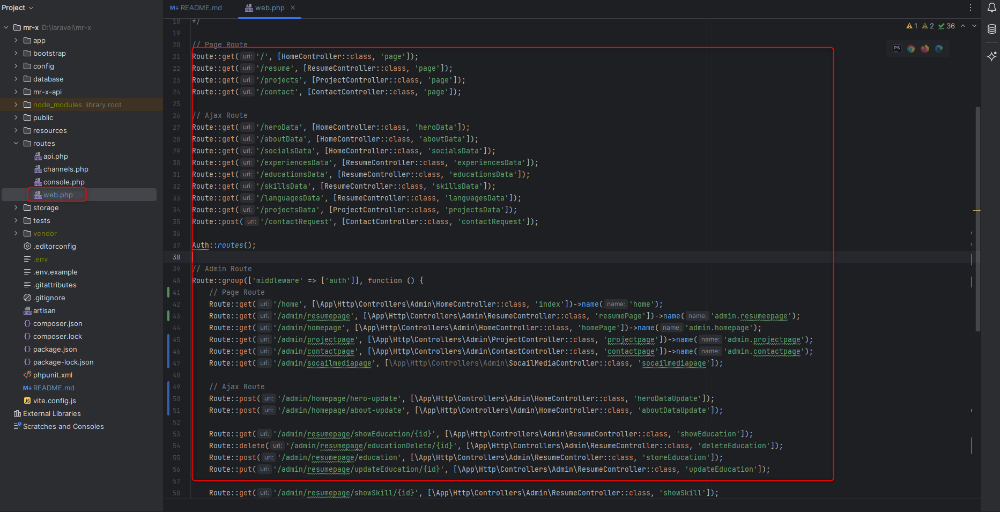

# MR-X

[//]: # (### [Live Link]&#40;https://mr-x.com&#41;)

MR-X (Web Developer Portfolio with Dashboard)

## Table of Contents

- [Description](#description)
- [Features](#features)
- [Demo](#demo)
- [Technologies Used](#technologies-used)
- [Installation](#installation)
- [Mr-x Folder Structure](#mr-x-folder-structure)
- [Pages](#pages)
- [Usage](#usage)
- [Contact](#contact)

## Description

MR-X (Web Developer Portfolio with Dashboard)

## Features
| Key Features             | Description                                                                                                            |
|--------------------------|------------------------------------------------------------------------------------------------------------------------| 
| Bootstrap Framework      | Bootstrap is the most popular HTML, CSS, and JS framework for developing responsive, mobile first projects on the web. |
| Responsive Layout Design | MR-X is fully responsive layout for all type of devices with min (320px).                                              |
| Dashboard                | MR-X is all content changeable.                                                                                        |

## Demo
Working Preview
<!-- 
 -->

## Technologies Used

List the technologies, libraries, frameworks, or languages that you used to build your project. You can also provide links to their official websites or documentation.

- Laravel
- MYSQL
- JavaScript
- Bootstrap 
- HTML
- CSS
## Installation

Clone the repository to your local machine

bash

    git clone https://github.com/ahmmedsabbirbd/mr-x.git

Open Project folder:

bash

     cd mr-x

Install the necessary dependencies by running the following command in the project directory:

bash

    composer install
    npm install

This will install all the required packages and dependencies needed to run the project.
Create a .env file in the root of the project and add the required environment variables. These variables may include database credentials, API keys, and other configuration details. You can find the list of required environment variables in the project's README.md file.
Start the development server by running the following command:

bash

    php artisan serve
    npm run dev

This will start the server and the application will be available at http://localhost:8000/.

Note: If you encounter any issues while installing or running the project locally, please refer to the project's documentation or reach out to the project maintainers for assistance.

## MR-X Folder Structure

#### Routes

#### Migrations

#### App

#### Resources

## Pages
#### 4 pages

1. ### Home Page

   

2. ### Resume Page

   
3. ### Project Page

   
4. ### Contact

   

## Dashboard Pages
#### 4 pages
5. ### Brands
6. z
   
6. ### Careers

   
7. ### Contact Us

   
8. ### Creators

   

10. ### Customer Story

    

11. ### Pricing Features

    

12. ### Try MR-X

    

## Usage
	Working

## API Documentation
Provide API only read website data, did not provide dashboard api

### Getting Started
To get started with mr-x, you will need to follow the installation instructions in the previous section.

## Contact

If you have any questions, feedback, or suggestions, feel free to contact us using the following methods:

- Email: ahmmedsabbirbd@gmail.com
- Linkdin: [https://www.linkedin.com/in/ahmmedsabbirbd](https://www.linkedin.com/in/ahmmedsabbirbd)
- Website: [https://sabbir-me.netlify.app](https://sabbir-me.netlify.app)

We appreciate your interest in our project and look forward to hearing from you!
